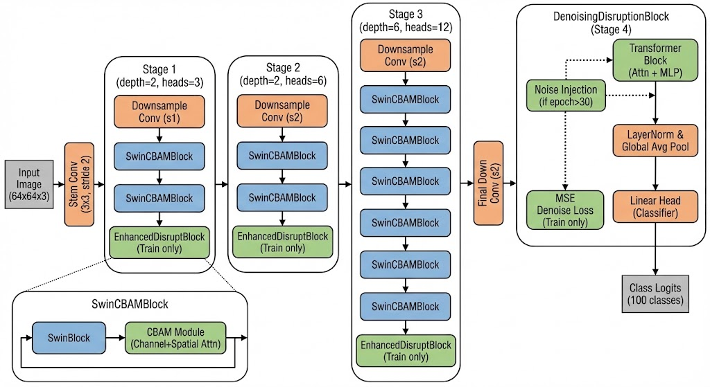

# Swin-Coffee: 10.76% improvement on swin-transformer, 基于特征去噪的高效视觉 Transformer

[](https://opensource.org/licenses/MIT)
[](https://pytorch.org)
[]()

**Swin-Coffee** 是一款专门针对小规模数据集（如 CIFAR-100）深度优化的视觉 Transformer 架构。它在标准 Swin Transformer 的基础上进行了多项创新，通过引入**卷积归纳偏置（Convolutional Inductive Bias）**和**自监督特征去噪任务（Self-Supervised Denoising）**，显著提升了模型在数据受限场景下的特征提取能力与泛化性能。

## 📊 性能表现

在 CIFAR-100 数据集（从零训练，64x64 分辨率）的实验中，Swin-Coffee 的表现大幅超越了原版 Swin-Tiny 基准。

| 模型 | 阶段深度 (Depths) | 参数量 | 训练环境 | 准确率 (Top-1) |
| :--- | :---: | :---: | :---: | :---: |
| Swin-Tiny (Baseline) | [2, 2, 6, 2] | ~28.3M | 从零训练 | 65.88% |
| **Swin-Coffee (Ours)** | **[2, 2, 6, 1]** | **~26.8M** | **从零训练** | **76.64%** 🚀 |

> **核心价值：** 在参数量减少约 **1.5M** 的情况下，Swin-Coffee 实现了 **10.76%** 的精度提升。这证明了该架构在处理小图特征提取时具有极高的效率。

## 💡 架构创新

Swin-Coffee 通过在标准层次化 Transformer 中嵌入注意力修正和特征扰动机制，构建了更为鲁棒的特征表示。

](https://opensource.org/licenses/MIT)
[](https://pytorch.org)
[]()

**Swin-Coffee** 是一款专门针对小规模数据集（如 CIFAR-100）深度优化的视觉 Transformer 架构。它在标准 Swin Transformer 的基础上进行了多项创新，通过引入**卷积归纳偏置（Convolutional Inductive Bias）**和**自监督特征去噪任务（Self-Supervised Denoising）**，显著提升了模型在数据受限场景下的特征提取能力与泛化性能。

## 📊 性能表现

在 CIFAR-100 数据集（从零训练，64x64 分辨率）的实验中，Swin-Coffee 的表现大幅超越了原版 Swin-Tiny 基准。

| 模型 | 阶段深度 (Depths) | 参数量 | 训练环境 | 准确率 (Top-1) |
| :--- | :---: | :---: | :---: | :---: |
| Swin-Tiny (Baseline) | [2, 2, 6, 2] | ~28.3M | 从零训练 | 65.88% |
| **Swin-Coffee (Ours)** | **[2, 2, 6, 1]** | **~26.8M** | **从零训练** | **76.64%** 🚀 |

> **核心价值：** 在参数量减少约 **1.5M** 的情况下，Swin-Coffee 实现了 **10.76%** 的精度提升。这证明了该架构在处理小图特征提取时具有极高的效率。

## 💡 架构创新

Swin-Coffee 通过在标准层次化 Transformer 中嵌入注意力修正和特征扰动机制，构建了更为鲁棒的特征表示。


*图 1: Swin-Coffee 总体架构。包含 Swin-CBAM 融合阶段、增强扰动模块以及末端的去噪重构头。*

### 1. Swin-CBAM 融合模块 (Stage 1-3)
前三个阶段的每个 Block 都采用了 **SwinCBAMBlock** 设计：
* **SwinBlock**: 保持窗口注意力的全局感知能力。
* **CBAM 组件**: 集成了通道和空间注意力机制。
    * **通道注意力 (Channel Attention)**: 动态调整通道特征权重。
    * **空间注意力 (Spatial Attention)**: 引入卷积操作带来的局部归纳偏置，有效弥补了 Transformer 局部感知能力的不足。

### 2. 增强扰动模块 (Enhanced Disrupt Block)
在 Stage 1, 2, 3 的末尾均配置了扰动层。在训练期间，该模块通过频率遮蔽和空间丢弃等手段对特征进行随机干预，强制模型学习更鲁棒的特征，有效防止过拟合。

### 3. 自监督去噪正则化 (Stage 4)
Stage 4 采用 **DenoisingDisruptionBlock** 替代了传统 Swin 层：
* **特征噪声注入**: 在训练中后期（Epoch 30+）引入高斯噪声。
* **重构任务**: 模型需同步完成分类与特征重构任务。这种自监督信号引导模型在噪声干扰下依然能提取出图像的本质特征。

## 🛠️ 项目结构

```text
Swin-Coffee/
├── swin_coffee.py       # 模型核心定义 (SwinCBAM, Disrupt, Denoise)
├── swin-coffee.jpg      # 模型架构图
├── logs/                # 训练日志 (.csv)
└── weights/             # 最佳模型权重文件 (.pth))
*图 1: Swin-Coffee 总体架构。包含 Swin-CBAM 融合阶段、增强扰动模块以及末端的去噪重构头。*

### 1. Swin-CBAM 融合模块 (Stage 1-3)
前三个阶段的每个 Block 都采用了 **SwinCBAMBlock** 设计：
* **SwinBlock**: 保持窗口注意力的全局感知能力。
* **CBAM 组件**: 集成了通道和空间注意力机制。
    * **通道注意力 (Channel Attention)**: 动态调整通道特征权重。
    * **空间注意力 (Spatial Attention)**: 引入卷积操作带来的局部归纳偏置，有效弥补了 Transformer 局部感知能力的不足。

### 2. 增强扰动模块 (Enhanced Disrupt Block)
在 Stage 1, 2, 3 的末尾均配置了扰动层。在训练期间，该模块通过频率遮蔽和空间丢弃等手段对特征进行随机干预，强制模型学习更鲁棒的特征，有效防止过拟合。

### 3. 自监督去噪正则化 (Stage 4)
Stage 4 采用 **DenoisingDisruptionBlock** 替代了传统 Swin 层：
* **特征噪声注入**: 在训练中后期（Epoch 30+）引入高斯噪声。
* **重构任务**: 模型需同步完成分类与特征重构任务。这种自监督信号引导模型在噪声干扰下依然能提取出图像的本质特征。

## 🛠️ 项目结构

```text
Swin-Coffee/
├── swin_coffee.py       # 模型核心定义 (SwinCBAM, Disrupt, Denoise)
├── swin-coffee.jpg      # 模型架构图
├── logs/                # 训练日志 (.csv)
└── weights/             # 最佳模型权重文件 (.pth)
